Hello, my name is Cristofer Hippleheuser. I like to build things.

<table border="0" cellspacing="0" cellpadding="0">
  <tr>
    <td valign="top" border="0"></td>
    <td width="12" border="0"></td>
    <td valign="top" border="0"></td>
  </tr>
</table>

